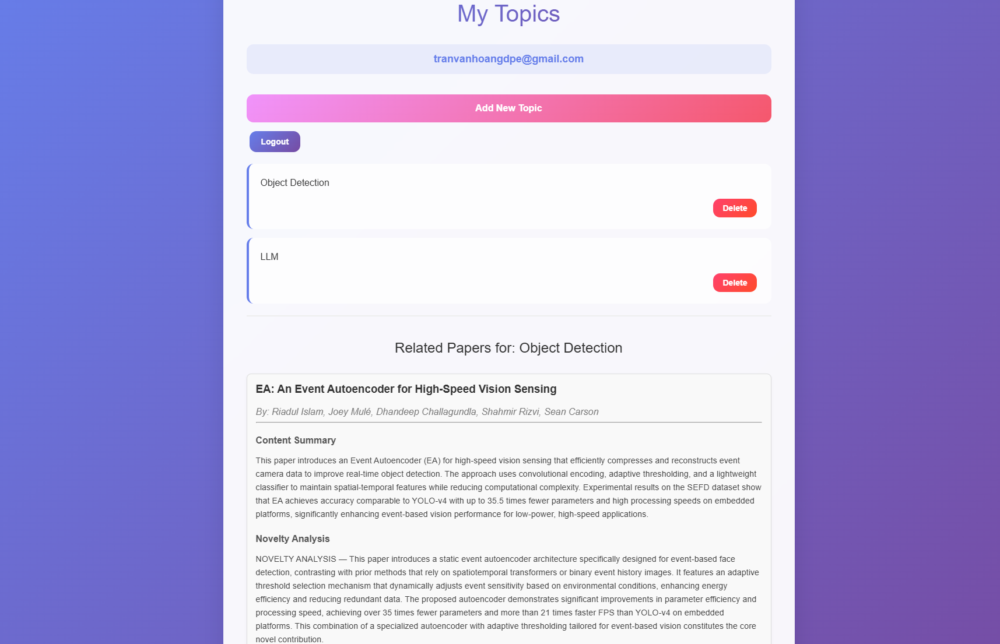

# 📚 Automated Paper Discovery & Notification System

[](https://opensource.org/licenses/MIT)
[](https://www.python.org/downloads/)
[](https://www.docker.com/)
[](https://milvus.io/)

## 🌟 Overview

An intelligent paper discovery system that automatically downloads new research papers weekly, processes their content using LLM, and delivers personalized recommendations to users based on their research interests. The system combines automated paper collection, content extraction, vector database storage, and hybrid RAG (Retrieval-Augmented Generation) for intelligent paper matching and notification.

## ✨ Key Features

- **🔄 Automated Paper Collection**: Weekly downloads of new research papers from various sources
- **📄 Advanced Content Extraction**: Utilizes Grobid for accurate paper information extraction
- **🗄️ Vector Database Storage**: Stores paper embeddings and metadata in Milvus for efficient retrieval
- **🎯 Personalized Recommendations**: Hybrid RAG system matches papers to user interests
- **📧 Email Notifications**: Automated delivery of relevant papers to subscribers
- **🌐 Web Interface**: User-friendly platform for topic subscription and paper browsing

## 🏗️ System Architecture

```
┌─────────────────┐    ┌─────────────────┐    ┌─────────────────────────────────┐
│   Paper Source  │───▶│   Grobid    │───▶│  Content Parser │ vector embedding
└─────────────────┘    └─────────────────┘    └─────────────────────────────────┘ 
                                                        │
                                                        ▼
┌─────────────────┐    ┌─────────────────┐    ┌─────────────────┐
│   Email Service │◀───│   Hybrid RAG    │◀───│ Milvus Database │
└─────────────────┘    └─────────────────┘    └─────────────────┘
                                │                       ▲
                                ▼                       │
                       ┌─────────────────┐    ┌─────────────────┐
                       │   Web Interface │────│  User Database  │
                       └─────────────────┘    └─────────────────┘
```


## 🚀 Quick Start

### Prerequisites

- **Docker** (version 20.10+)
- **NVIDIA GPU** with CUDA support (recommended)
- **Python 3.10+**
- **3GB+ RAM**

### Installation

#### 1. Install Grobid Service

Grobid is essential for extracting structured information from PDF papers. Follow the [official documentation](https://grobid.readthedocs.io/en/latest/) for detailed setup instructions.

```bash
# Pull the latest Grobid Docker image
docker pull grobid/grobid:${latest_grobid_version}

# Run Grobid container with GPU support
docker run -itd \
  --name grobid_container \
  -p 8070:8070 \
  -p 8071:8071 \
  --gpus all \
  grobid/grobid:${latest_grobid_version}
```

#### 2. Setup Milvus Vector Database

Milvus serves as our vector database for storing paper embeddings and metadata efficiently.

```bash
# Download Milvus standalone script
curl -sfL https://raw.githubusercontent.com/milvus-io/milvus/master/scripts/standalone_embed.sh -o standalone_embed.sh

# Start Milvus container
bash standalone_embed.sh start
```

#### 3. Pull Backend Image

```bash
# Pull the pre-built application image
docker pull haeako/tvhsummarypaper:custom-v1

# Run the application container
docker run -itd \
  --gpus all \
  -v /mlcv2:/mlcv2 \
  -p 8777:8777 \
  --name tvhpaper \
  haeako/tvhsummarypaper:custom-v1
```


## 🔧 Configuration

### Environment Variables

Create a `.env` file in your project root:

```env
# Grobid Configuration
GROBID_SERVER=http://{IP your server}:8070  
GROBID_TIMEOUT=300

# Milvus Configuration
MILVUS_URI=http://{IP your server}:19530
MILVUS_COLLECTION={name collection}

OPENAI_API_KEY={your OPENAI API KEY}
OPENAI_MODEL ={Model GPT such as gpt-4.1-nano}

# Email Configuration
SMTP_HOST=smtp.gmail.com
SMTP_PORT=587
SMTP_USERNAME={Email setup for this system}
SMTP_PASSWORD={Email password 16 characters}

# API Configuration
API_HOST=0.0.0.0
API_PORT=8077

# ML Model Configuration
EMBEDDING_MODEL={You can change the model in the embedding.py file}
DEVICE=cuda:0
```

### Database Schema

Each paper will store the following information:

- **content**: Save the main idea of ​​the article
- **sparse_vector**: Used for comparison according to BM25 metric
- **dense_vector**: Vector embedding of the main content of the article
- **paper_authors**: Save authors name
- **title_paper**: Save paper title
- **novelty**: Novelty content of the article
- **pdf_url**: Link to paper pdf

## 🚀 Usage

### 1. Start the Main Processing Pipeline

The main pipeline handles automatic paper download, content extraction, and database storage:

```bash
# Set GPU device and run the main pipeline
CUDA_VISIBLE_DEVICES=0 python src/main.py
```

**Pipeline Features:**
- Downloads papers from configured sources
- Extracts text, metadata, and structure using Grobid
- Generates embeddings and stores in Milvus
- Processes user subscriptions and sends notifications

### 2. Launch Web Interface

Start the backend API server for the web interface:

```bash
# Run the FastAPI backend
uvicorn main:app --host 0.0.0.0 --port 8777
```

**Web Interface Features:**
- User registration and authentication
- Topic subscription management
- Paper browsing and search
- Personalized recommendations
- Email notification preferences


